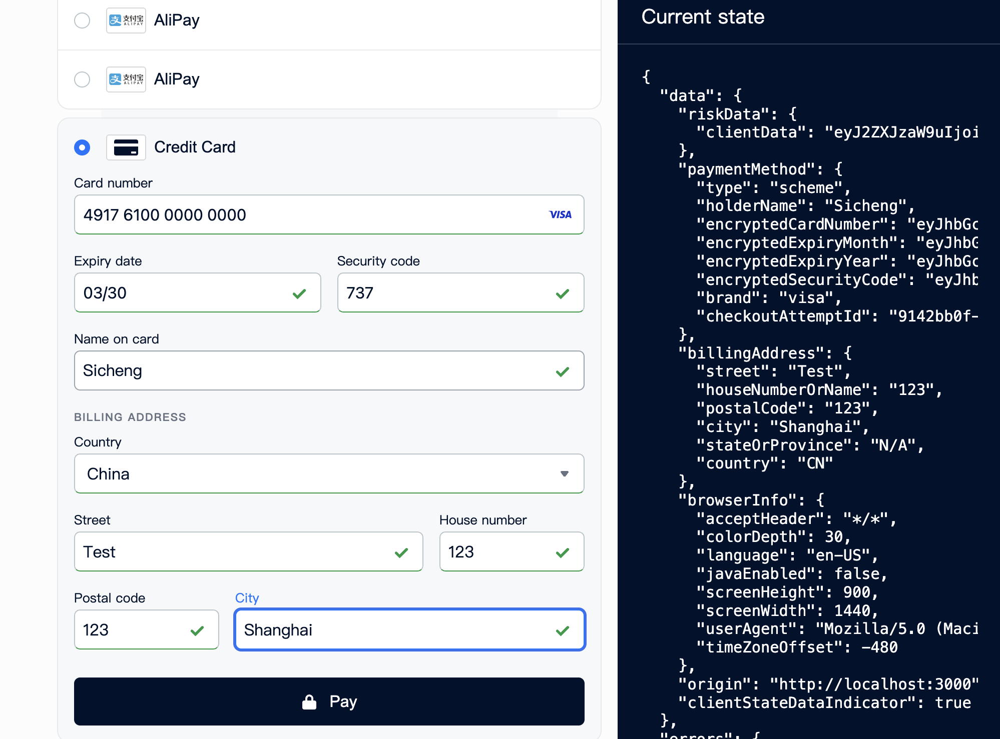
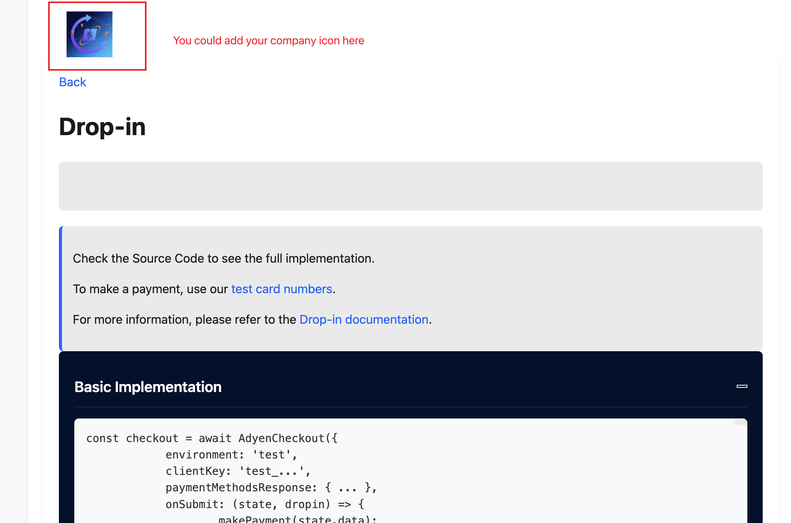
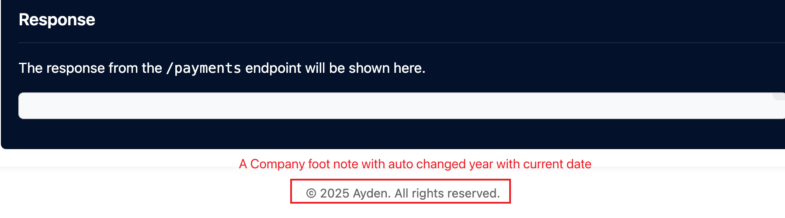

# Adyen Web sample code


> ⚠️ **This repository is for demo purposes only**

## Requirements

To run this project, **create** a `.env` file on your project's root folder following the example on `.env.default`.

```
MERCHANT_ACCOUNT=MyMerchantAccount
CHECKOUT_APIKEY=MY_CHECKOUT_API_KEY
CLIENT_KEY=MY_CLIENT_KEY
```

These variables can be found in Adyen Customer Area. For more information, visit our [Get started with Adyen guide](https://docs.adyen.com/get-started-with-adyen#page-introduction).

If the forms don't seem to load, please check if you have:

1. Used the correct `clientKey`
2. Configured the `origin` on the Customer Area as an allowed origin

## Installation

### Running the PHP Server

Navigate to the root of the project and run the `start.sh` script:

```
$ cd adyen-components-js-sample-code
$ ./start.sh
```

A PHP server will start on `http://localhost:3000`.

### Running the Node.js Server

If preferred, you can run a Node.js server instead.
To do this, navigate to the root of the project, install the dependencies (only the first time) and run the start script:

```
$ cd adyen-components-js-sample-code
$ npm i
$ npm start
```

A Node.js server will start on `http://localhost:3000`.

### Deploying this example to Heroku

Alternatively, you can install this example by using this shortcut to deploy to Heroku:

[](https://heroku.com/deploy?template=https://github.com/Adyen/adyen-components-js-sample-code)

After deploying, to use Sessions Drop-in, add your ```CLIENT_KEY``` to the config vars.

## Documentation

For the complete integration guide, refer to the [Web Components documentation](https://docs.adyen.com/online-payments/web-components).

## Other sample projects

Find other sample projects in our [example projects repositories](https://github.com/adyen-examples).

## License

This repository is open source and available under the MIT license. For more information, see the LICENSE file.


## Sicheng Out-put


### Response
```
{
  "additionalData": {
    "fraudResultType": "GREEN",
    "cardHolderName": "Sicheng",
    "cardSummary": "0000",
    "isCardCommercial": "unknown",
    "fraudManualReview": "false",
    "PaymentAccountReference": "OpXN3tK9riZjFpVMvklioj8LQ2Bao",
    "threeds2.threeDS2ResponseData.messageVersion": "2.2.0",
    "threeds2.threeDS2Token": "xxxxx",
    "issuerCountry": "PL",
    "expiryDate": "3/2030",
    "threeds2.threeDSServerTransID": "1d983972-3cac-4d76-8e03-f4fd537d55bf",
    "cardBin": "491761",
    "threeds2.cardEnrolled": "true",
    "paymentMethod": "visa",
    "cardPaymentMethod": "visacredit",
    "paymentMethodVariant": "visacredit",
    "fundingSource": "CREDIT",
    "merchantReference": "Sicheng_adyenrecruitment",
    "issuerBin": "49176100",
    "threeds2.threeDSMethodURL": "https://pal-test.adyen.com/threeds2simulator/acs/startMethod.shtml",
    "cardIssuingCountry": "PL"
  },
  "pspReference": "FTKH7GG5N869FH75",
  "resultCode": "RedirectShopper"
```


## Sicheng Add-on
New File `dropin-custom.css` is for a new flat style version.
You could change the css root in `../scr/dropin/index.html` to the new css file and remove the comments in the it, you can get below sample style.

  



## My thoughts on Ayden payment techinque
非常好的问题！下面我将为你**全面拆解 Adyen 聚合支付 API 的技术实现逻辑**，从商户准备工作，到各个 API 的作用、认证流程、安全机制和底层工作原理，一步步来讲清楚。

---

### 🧾 一、准备工作（商户侧）

在你调用 Adyen 的 API 之前，你需要完成一些准备：

#### ✅ 1. 注册并登录 Adyen 商户账号

* 访问 [https://ca-test.adyen.com/](https://ca-test.adyen.com/) 注册 test account
* 获得你的 `merchantAccount` 名称

#### ✅ 2. 获取 API 密钥

* 进入 `Developers > API Credentials` 创建一个 API 用户
* 获取：

  * `API Key`（用于后端调用）
  * `Client Key`（用于前端 Drop-in）

#### ✅ 3. 配置 Webhook 通知地址

* 用于接收支付状态异步通知（后端接口）

#### ✅ 4. 集成 SDK（前端 & 后端）

* 前端：Adyen Checkout SDK (Drop-in)
* 后端：可用任意支持 HTTP 请求的语言调用 REST API，如 PHP/Node.js/Java

---

### 🔧 二、技术架构图

```text
用户浏览器 ──> 前端 Drop-in SDK ──┐
                                 │
后端服务器 <── HTTP JSON API <──┘
         │
         └─> Adyen 后台系统
              │
              └─> 银行 / 支付渠道
```

---

### 📦 三、核心 API 流程与作用

#### ✅ 1. `/sessions`
> **作用**：创建支付会话，返回 sessionId 和 sessionData，用于前端 Drop-in 初始化。

```json
POST /sessions
{
  "amount": { "value": 1000, "currency": "EUR" },
  "reference": "ORDER123",
  "returnUrl": "https://yourdomain.com/payment-return",
  "merchantAccount": "YourMerchantAccount"
}
```

返回：

```json
{
  "id": "ABCDEF...",
  "sessionData": "XYZ..."
}
```

👉 这个接口结合 Drop-in 后，前端自动处理支付流程（包括 3D Secure、跳转等）。

---

#### ✅ 2. `/paymentMethods`

> **作用**：查询当前 shopper 可用的支付方式（非 session 模式时用）

---

#### ✅ 3. `/payments`

> **作用**：创建支付（非 session 模式），返回是否需要跳转（如 3DS）

```json
{
  "amount": { "value": 1000, "currency": "EUR" },
  "paymentMethod": { ... },
  "reference": "ORDER123",
  "returnUrl": "https://yourdomain.com/payment-return",
  ...
}
```

返回：

* `resultCode: Authorised`
* 或 `resultCode: RedirectShopper` + `action.url`

---

#### ✅ 4. `/payments/details`

> **作用**：用于处理 `3D Secure`、`PayPal` 等重定向返回的 `redirectResult`，完成支付验证

```json
POST /payments/details
{
  "redirectResult": "xyz..."
}
```

---

#### ✅ 5. `/payments/cancels`, `/refunds`, `/captures`

> 用于后续的支付生命周期管理：撤销、退款、分期扣款等

---

### ✅ 6. Webhook（通知）

> **作用**：Adyen 主动通知支付状态变化，如授权成功、失败、退款等

```json
{
  "eventCode": "AUTHORISATION",
  "success": "true",
  "pspReference": "...",
  "merchantReference": "ORDER123",
  ...
}
```

需要校验签名（HMAC），以确保通知可靠性。

---

### 🔐 四、API 认证机制（安全）

#### ✅ 后端接口认证（API key）：

所有 `/sessions`、`/payments`、`/details` 等接口必须使用 `X-API-Key` 头：

```http
X-API-Key: Your_Secret_API_Key
```

* 此密钥为服务端专用，**绝不能暴露给前端**。
* 可以在 Adyen 后台创建多个 API 用户，为不同系统配置不同权限。

---

#### ✅ 前端 SDK 认证（Client Key）：

用于前端 Drop-in 初始化配置：

```js
AdyenCheckout({
  clientKey: "test_CLIENT_KEY",
  ...
})
```

* 此 key 是 **只读** 的，可公开，不能用于提交支付或访问敏感资源。
* 仅用于 Drop-in 获取配置、加密支付数据。

---

#### ✅ Webhook 安全（HMAC 验证）：

Adyen 会向商户后端 webhook 地址发送支付状态通知，你必须用 `HMAC` 验证数据的完整性。

* 后台提供 HMAC key
* 使用 SHA-256 校验 `data + key` 的签名是否匹配

---

### 🧠 五、底层工作机制概览

| 阶段     | 底层原理                                          |
| ------ | --------------------------------------------- |
| 支付初始化  | 会话/session 建立，将支付意图和配置绑定                      |
| 支付表单   | Drop-in 组件根据配置展示不同支付方式（信用卡、Apple Pay、Klarna等） |
| 加密提交   | 前端加密支付数据（如卡号）并发送到后端                           |
| 风控拦截   | Adyen 可结合自定义风控规则进行实时拦截（如 velocity, BIN block） |
| 重定向跳转  | 由 Adyen 后台返回跳转地址（如银行 3D Secure）               |
| 回跳商户页面 | 支付完成后返回商户设置的 `returnUrl`                      |
| 状态通知   | Adyen 异步发送 webhook，商户更新订单状态                   |

---

### ✅ 六、流程图：全流程概览

```text
用户浏览器
    │
    ▼
加载 Drop-in（通过 /sessions 获取 sessionId）
    │
    ▼
用户选择支付方式 → 提交支付
    │
    ▼
Adyen 返回 RedirectShopper → 跳转到银行/PayPal 页面
    │
    ▼
用户完成支付 → 回跳 returnUrl
    │
    ▼
前端获取 redirectResult → 调用 /payments/details
    │
    ▼
Adyen 返回 resultCode → 显示支付成功/失败页
    │
    ▼
后台接收 webhook 通知（最终状态确认）
```

---

### ✅ 七、你需要准备的整合组件一览

| 项目                | 是否必需 | 用途说明             |
| ----------------- | ---- | ---------------- |
| `API Key`         | ✅    | 后端调用 Adyen API   |
| `Client Key`      | ✅    | 前端初始化 Drop-in    |
| `merchantAccount` | ✅    | 商户标识，所有请求都要      |
| `returnUrl`       | ✅    | 用户完成支付后跳转地址      |
| Drop-in SDK       | ✅    | 前端组件展示支付方式       |
| Webhook 接口        | ✅    | 接收支付状态变更通知       |
| HMAC Key          | ✅    | 验证 webhook 消息完整性 |

---

### 八、📊 Adyen 支付核心 API 功能对照表
| 接口名                     | 功能说明                        | 请求时机                          | 输入参数                                                                                          | 返回结果                                          | 使用场景                                                  |
| ----------------------- | --------------------------- | ----------------------------- | --------------------------------------------------------------------------------------------- | --------------------------------------------- | ----------------------------------------------------- |
| **`/paymentMethods`**   | 获取当前商户支持的支付方式               | 页面加载初始化时                      | `merchantAccount`, `countryCode`, `amount`, `channel`, `shopperLocale` 等                      | 返回所有可用支付方式（如卡、PayPal、ApplePay 等）              | 前端 Drop-in 初始化；根据国家/金额动态渲染支付方式                        |
| **`/payments`**         | 创建支付请求                      | 用户提交支付表单时                     | `paymentMethod`, `amount`, `returnUrl`, `merchantAccount`, `reference`, `channel`, `origin` 等 | 返回 `resultCode` 或 `action`（如跳转、3DS challenge） | 创建支付；可能需要后续继续执行 `/payments/details`                   |
| **`/payments/details`** | 继续执行支付流程（通常是 3D Secure 验证后） | 用户完成 3DS challenge 后          | `details`（前端从 Drop-in 组件收集）, `paymentData`                                                    | 返回最终支付状态（Authorised、Refused、Pending 等）        | 完成 3DS 验证后的流程；Drop-in 自动调用此接口                         |
| **`/sessions`**         | 初始化会话，用于 Drop-in 全流程        | 页面加载时（推荐替代 `/paymentMethods`） | `merchantAccount`, `amount`, `reference`, `returnUrl`, `countryCode` 等                        | 返回 session 数据（用于 Drop-in 组件），包括支付方式与支付凭据      | 推荐使用；结合 Drop-in 使用可整合 `/paymentMethods` 与 `/payments` |


### 九、drop-in流程图

#### Drop-in+/session


#### Drop-in+/payments


#### Drop-in+/session+/payments
